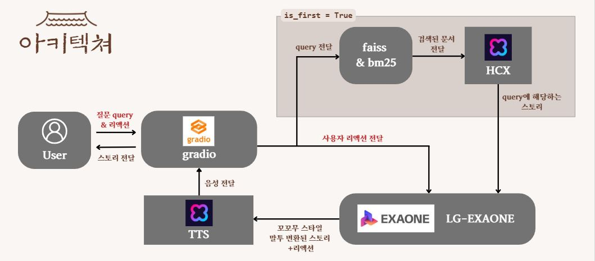

# Rag-kokkomu-joseon-chatbot | 꼬리에 꼬리를 무는 조선왕조실톡

## 🌟 **Project Overview | 프로젝트 개요**
이 프로젝트는 진입장벽이 높은 한국사를 쉽게 접근할 수 있도록 참여형 스토리텔링 방식을 활용하는 꼬꼬무 스타일의 RAG 기반 챗봇입니다. 사용자가 특정 주제에 대한 질문을 던지면, 챗봇이 RAG 모델을 활용하여 꼬꼬무 형식으로 이야기를 구성해 제공합니다.

---

## 🧑‍🤝‍🧑 **Team Members | 팀원**
- **13기**: 김재겸, 서영우, 이형석, 임채현

---

## 📅 **Progress Period | 진행 기간**
- **2024.12.23 ~ 2025.02.22**

---

## 📊 **Data Collection | 데이터 수집**
- **조선왕조실록 DB**: 원문 추출 후 한국어로 번역 및 txt 파일로 저장
- **7차 교육과정 한국사 교과서**: OCR 및 Chunk화를 통해 txt 파일로 저장

---

## 🚀 **Features | 주요 특징**
- **조선왕조실록 기반**: 한국사 콘텐츠 중에서도 조선왕조실록을 중심으로 스토리를 구성
- **꼬꼬무 스타일 스토리텔링**: 사용자의 질문을 기반으로 몰입감 있는 이야기 전달
- **멀티턴 대화 지원**: 한 번의 답변으로 끝나지 않고 후속 질문을 통해 점진적으로 깊이 있는 이야기 제공 
- **RAG 모델 활용**: 사전 학습된 LLM과 검색 기술을 결합하여 신뢰도 높은 응답 생성
- **참여형 구성**: 단순 정보 제공이 아닌, 사용자가 몰입할 수 있는 서사 구조 적용

---

## 📁 **Key Directories and Files | 주요 디렉토리 및 파일**

📁 project-root/      
│── 📂 models/         # 프로젝트 모델 및 RAG
│── 📂 scripts/        # 모델 성능 평가
│── 📂 web/            # Gradio 웹 인터페이스
│── 📂 images/         # 이미지 디렉토리
│── 📄 main.py          # 프로젝트 실행 진입점  
│── 📄 requirements.txt # 프로젝트 전체 의존성 정의  
│── 📄 README.md        # 프로젝트 개요 및 설명  
│── 📄 LICENSE          # MIT 라이선스 정보 

---


---

## 🛠️ **Installation and Execution | 설치 및 실행 방법**
1. **Clone the repository | 저장소 클론**:
    ```bash
    git clone https://github.com/maeseok/Rag-kokkomu-joseon-chatbot
    ```

2. **Install required packages | 필수 패키지 설치**:
    ```bash
    pip install -r requirements.txt
    ```

3. **Run the main script | 실행**:
    ```bash
    python ./main.py
    ```

---

## 📖 **Usage | 사용 방법**
- RAG :  `models/retriever.py`와`models/generator.py`에서 확인합니다.
- 웹 페이지 실행: `web/app.py`를 실행하면 **Gradio 기반 웹 인터페이스**가 동작합니다.  
- Retriever 성능 평가 : `scripts/eval.py`에서 확인합니다.

---

## 📽️ Demonstration | 데모 시연

### 1. 결과 페이지


### 2. Flowchart


### 3. 동영상 데모 (사진을 클릭해주세요)
[](https://www.youtube.com/watch?v=IgEfCTvjx6E)

---

## 🎯 **Project Impact | 프로젝트 효용**  
- **한국사 접근성 향상**: 진입장벽을 낮추고, 누구나 쉽게 역사를 접할 수 있도록 지원  
- **스토리 중심 학습 제공**: 단순한 정보 전달이 아닌, 몰입감 있는 스토리텔링 방식으로 기억에 남는 학습 경험 제공  
- **참여형 역사 학습**: 기존의 일방향적 학습 방식에서 벗어나, 사용자의 질문과 피드백을 반영하는 인터랙티브 시스템 구축  
- **지속적인 흥미 유도**: 꼬꼬무 스타일의 서사 구조를 통해 역사적 사건에 대한 호기심과 탐구심 촉진  

---

## 📖 ** Model evaluation | 성능 평가 결과**


## 📜 **License | 라이선스**
This project is licensed under the MIT License. See the [LICENSE](./LICENSE) file for details.  
이 프로젝트는 MIT 라이선스 하에 배포됩니다. 자세한 내용은 [LICENSE](./LICENSE) 파일을 참고하세요.

